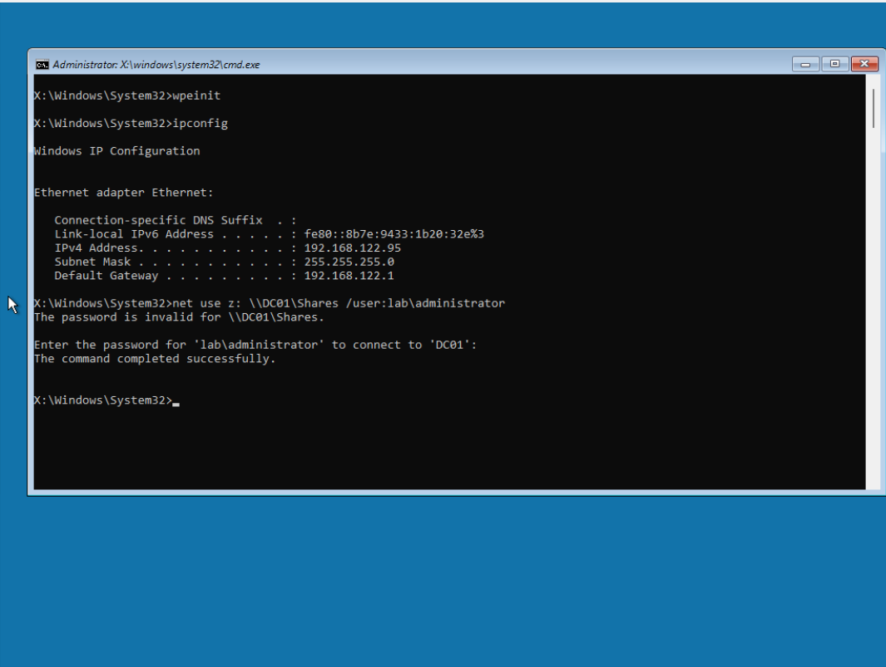
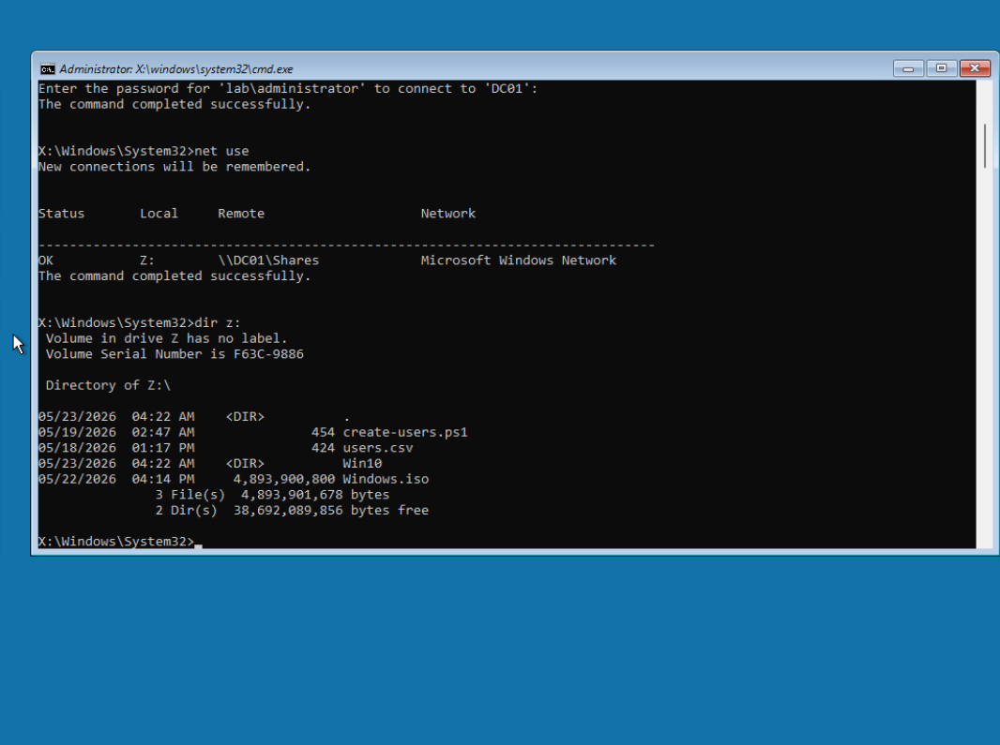
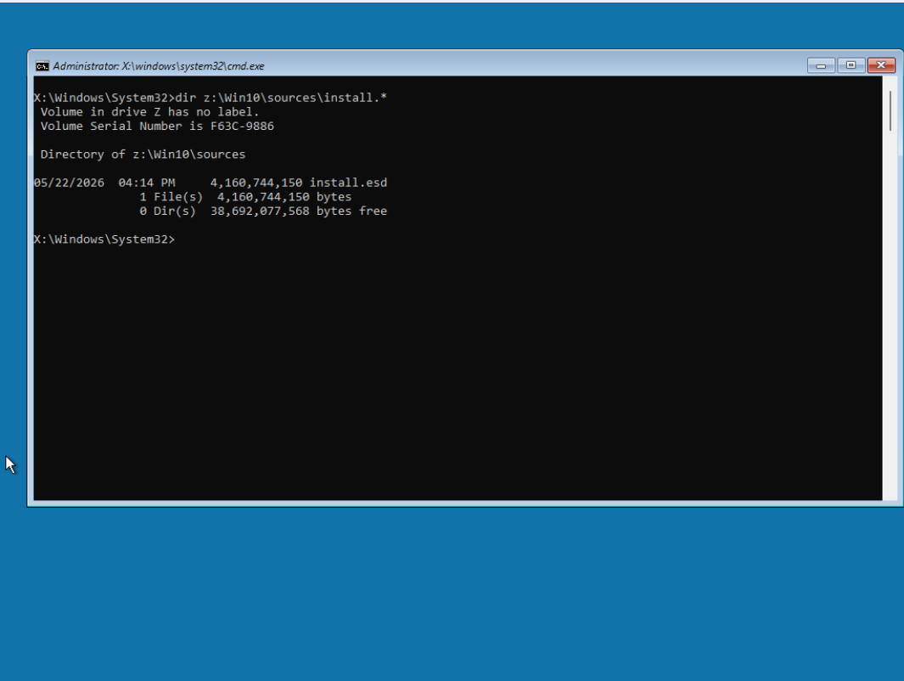
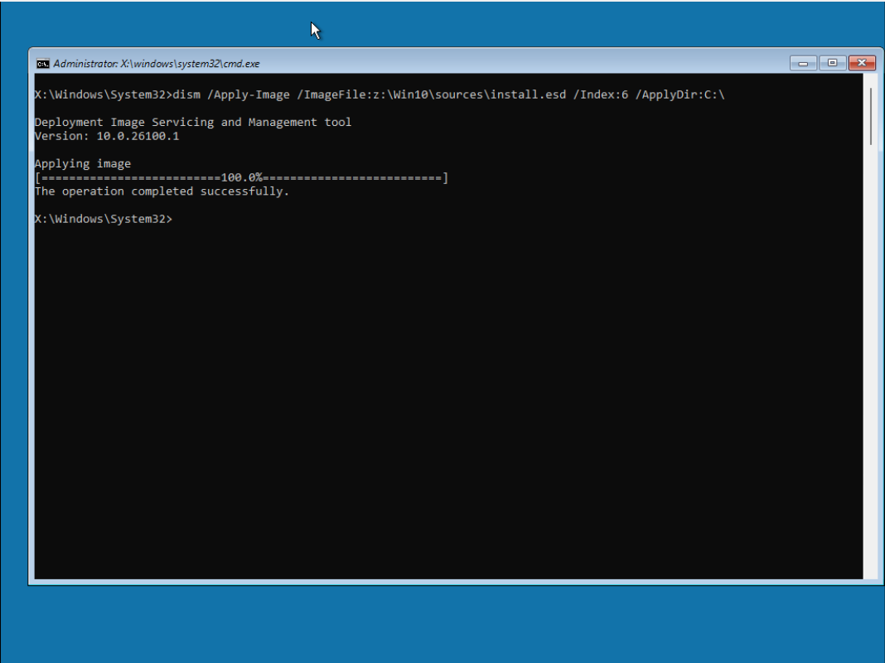
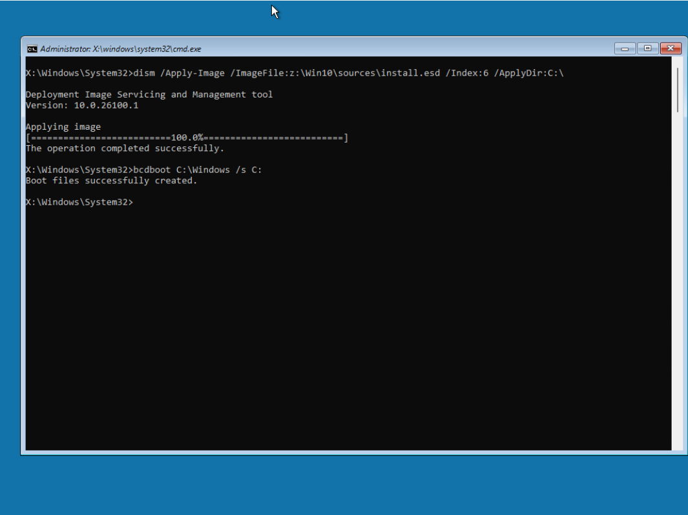
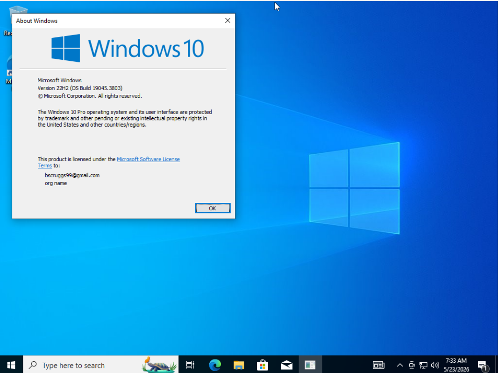
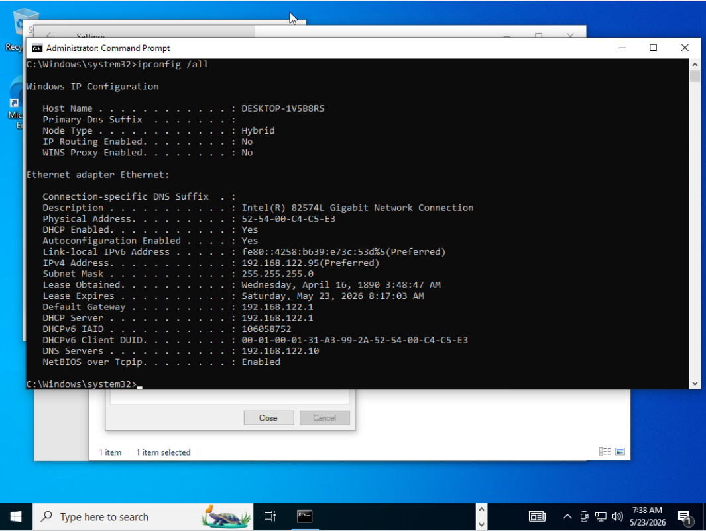
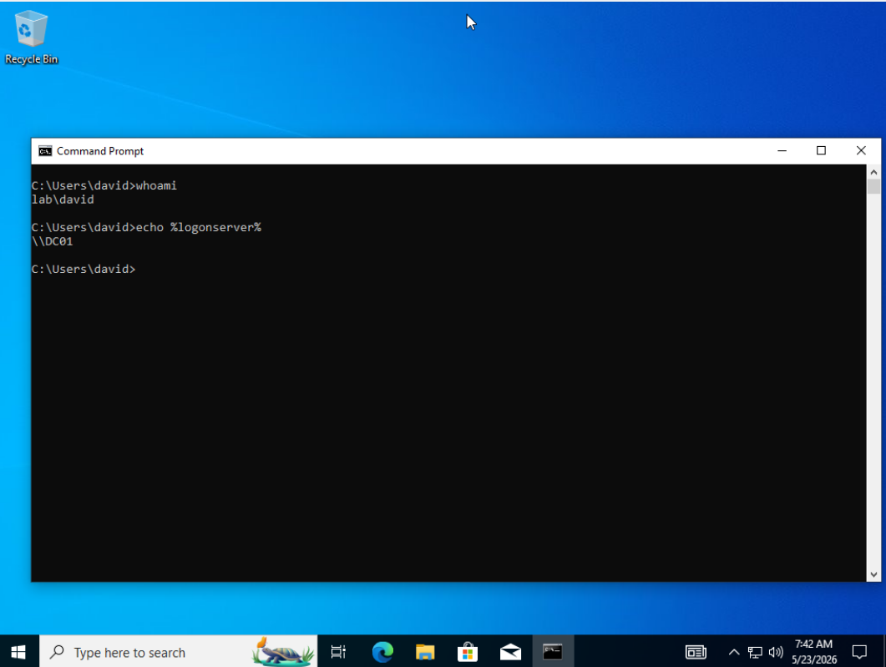
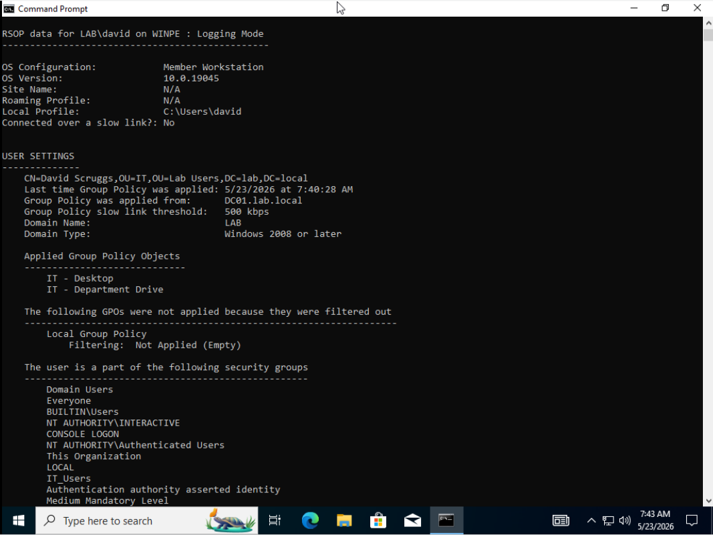
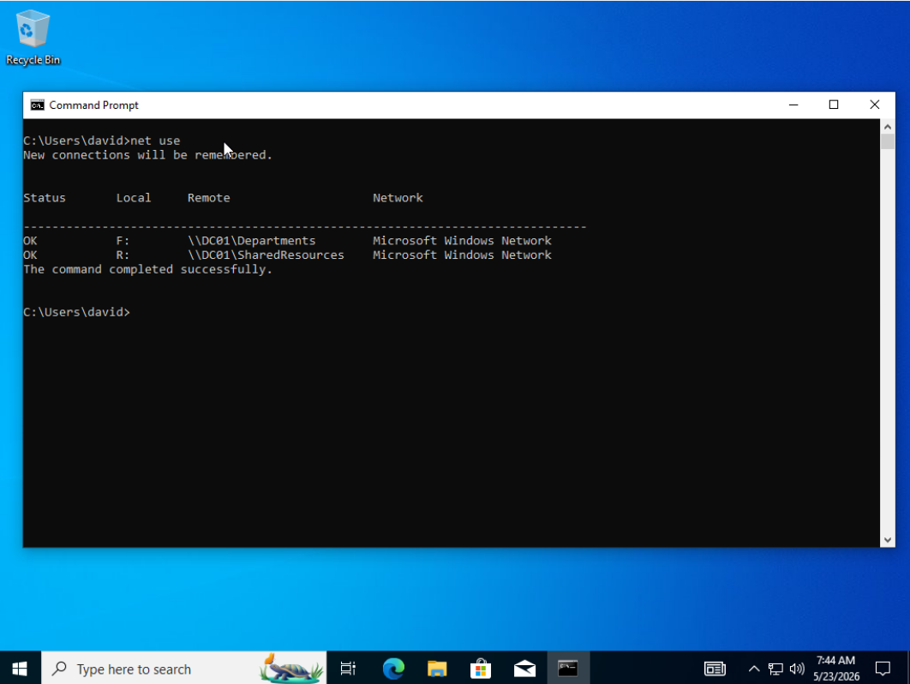

# windows-server-deployment-ad-lab


## Overview

This lab demonstrates a basic Windows workstation deployment and Active Directory onboarding workflow using Windows Server 2022, WinPE, DISM, and Group Policy.

A Windows Server 2022 virtual machine was configured with a shared deployment folder containing Windows 10 installation files. A blank Windows workstation VM was booted into WinPE, connected to the server-hosted deployment share, and had Windows 10 Pro applied using DISM. After deployment, the workstation was joined to the 'lab.local' Active Directory domain and tested with a pre-existing domain user account to verify Group Policy application and mapped drive configuration.

The goal of this project was to practice the underlying steps behind workstation imaging/deployment, domain joining, and basic post-deployment verification in a small lab environment.

## Lab Environment

- Host OS: Debian Linux
- Virtualization: KVM / virt-manager
- Server: Windows Server 2022
- Client/Target Workstation: Windows 10 Pro
- Deployment Environment: Windows PE created with Windows ADK
- Domain: lab.local
- Domain Controller: DC01
- Deployment Share: \\DC01\Shares
- Network: libvirt NAT network, 192.168.122.0/24

## Topology

```text
Debian Linux Host / KVM
└── libvirt NAT Network: 192.168.122.0/24
    │
    ├── DC01 - Windows Server 2022
    │   ├── Active Directory Domain Services
    │   ├── DNS
    │   ├── Domain: lab.local
    │   └── Deployment Share: \\DC01\Shares
    │
    └── WIN10-DEPLOYED - Windows 10 Pro
        ├── Booted into WinPE
        ├── Mapped \\DC01\Shares as Z:
        ├── Applied Windows image using DISM
        ├── Joined to lab.local
        └── Verified Group Policy and mapped drive
```


Process flow diagram:

```markdown
## Deployment Flow

Blank VM
  ↓ boot WinPE
WinPE Environment
  ↓ map network share
\\DC01\Shares
  ↓ apply install.esd with DISM
Windows 10 Pro installed
  ↓ join domain
lab.local
  ↓ log in as domain user
Group Policy / mapped drive verified
```

## Objectives

- Create a basic Windows deployment share on Windows Server 2022.
- Boot a blank workstation VM into Windows PE.
- Connect the WinPE environment to a server-hosted deployment share.
- Deploy Windows 10 Pro to the blank VM using DISM.
- Use BCDBoot to make the deployed Windows installation bootable.
- Join the deployed workstation to the `lab.local` Active Directory domain.
- Log in with a domain user account.
- Verify Group Policy application and mapped drive configuration using `gpresult` and `net use`.

## Deployment Workflow

1. Booted the blank workstation VM into Windows PE.
2. Verified network connectivity with `ipconfig`.
3. Mapped the deployment share from DC01:

   `net use Z: \\DC01\Shares /user:lab\administrator`

4. Verified the Windows image was available:

   `dir Z:\Win10\sources\install.*`

5. Confirmed the Windows 10 Pro image index:

   `dism /Get-WimInfo /WimFile:Z:\Win10\sources\install.esd`

6. Prepared the blank disk using `diskpart`.
7. Applied Windows 10 Pro using DISM.
8. Created boot files using `bcdboot`.
9. Rebooted into Windows 10 Pro setup.
10. Joined the deployed workstation to `lab.local`.
11. Logged in as a domain user and verified Group Policy/mapped drive application.

## Active Directory / GPO Verification

After deploying Windows 10 Pro and joining the workstation to the `lab.local` domain, I logged in using a domain user account to verify that Active Directory authentication and Group Policy processing were working correctly.

The following checks were performed:

- Confirmed the logged-in domain user with `whoami`
- Confirmed the logon server with `echo %logonserver%`
- Verified applied Group Policy Objects with `gpresult /r`
- Verified mapped drive application with `net use`

The test confirmed that the workstation successfully authenticated against the domain controller, received the expected user-based Group Policy settings, and mapped the department drive based on the user's AD group membership.

## Screenshots

### WinPE network connectivity


### Deployment share mapped from Windows Server 2022



### Windows image available from deployment share



### DISM Applying Windows image



### Created BCD environment



### Windows Version Verification



### Verifying IP and DNS post-deployment



### Verifying correct user and logon server 



### Group Policy verification



### Verifying mapped drives




## Issues Encountered and Troubleshooting Notes

During the lab, I encountered several issues that helped reinforce important deployment and Active Directory troubleshooting concepts:

- **Windows edition selection:** The first deployment used the default image index, which installed Windows 10 Home instead of Windows 10 Pro. I used `dism /Get-WimInfo` to inspect the available image indexes and selected the correct Windows 10 Pro index for the next deployment.

- **ISO vs. image file source:** Initially, I placed the Windows ISO on the deployment share, but DISM requires access to the actual Windows image file inside the ISO. I extracted the ISO contents to the deployment share and used `install.esd` as the deployment source.

- **Network-based deployment path:** I confirmed that WinPE could access the server-hosted deployment files by mapping `\\DC01\Shares` to the `Z:` drive and verifying the image path before applying the image.

- **Domain join troubleshooting:** After deployment, the workstation initially could not join the domain until DNS was configured to point to the domain controller. This reinforced that Active Directory domain joins depend on DNS being able to locate domain services.

- **Domain name vs. domain controller name:** I initially attempted to join the workstation using the domain controller hostname instead of the domain name. The correct domain join target was `lab.local`, not `DC01`.

- **User context and Group Policy testing:** Group Policy did not appear to apply at first because I was logged in with the wrong user account. I used `whoami` and `whoami /groups` to verify the active logon account and group membership, then confirmed the expected policy and mapped drive applied when logging in as the correct domain user.

These issues reinforced the importance of validating image indexes, confirming deployment paths, verifying DNS before domain join, and checking the active user context when troubleshooting Group Policy. Each issue was resolved through command-line verification and step-by-step testing.

## Future Improvements

- Create an unattended answer file (`unattend.xml`) to automate Windows setup and reduce manual OOBE configuration.
- Automate domain joining during deployment using a limited-purpose domain join account.
- Add post-deployment scripting for computer naming, application installation, and baseline configuration.
- Move deployed workstation objects into the correct Active Directory OU for workstation Group Policy targeting.
- Explore creating and deploying a custom captured Windows image.
